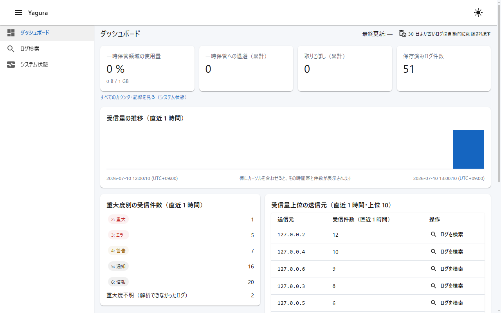
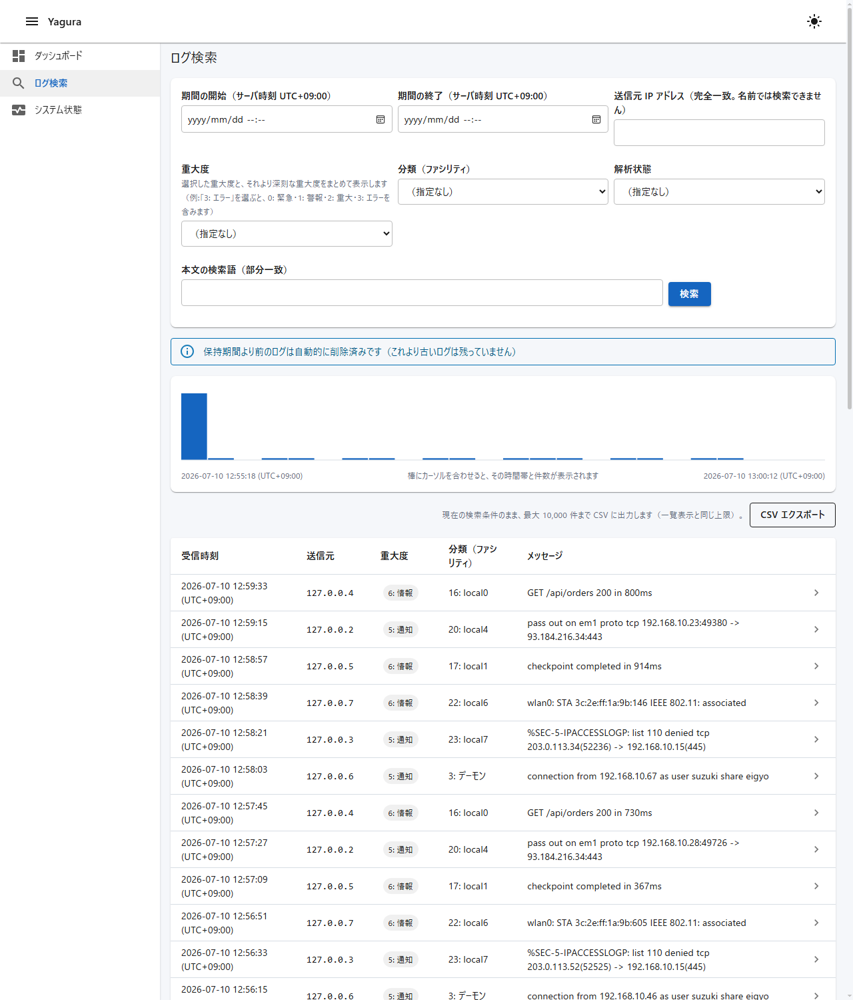

# Yagura（やぐら）


> **English**: Yagura is a Windows-native open-source syslog server. Install the MSI, point your network devices at UDP/TCP 514, and open the built-in web viewer — no configuration files, no extra database setup, no Linux VM, no license fees. It runs as a Windows service with an embedded SQLite store out of the box and can later be promoted to SQL Server through a built-in wizard. Windows Event Log forwarding is covered by a bundled Fluent Bit kit, and the admin UI can generate a pre-configured kit (ZIP) pointing at your server. v0.2 is released for evaluation on trusted networks; it is not yet recommended for production (the v1.0 criteria are defined in [ADR-0006](docs/adr/0006-v1-release-criteria.md), in Japanese). Documentation is Japanese-first. License: Apache-2.0.

**Windows ネイティブな OSS syslog 集約サーバ——インストール直後、設定なしで受信・閲覧が始まります。**

商用製品のライセンス費用も、Linux サーバの構築・運用スキルも要りません。Windows 管理者が既に持っているスキル（Windows サービス・SQL Server・Active Directory の運用）だけで導入・運用できることを最優先に設計しています。

## v0.2 の位置づけ

**v0.2 は評価・試用向けのリリースです。本番利用はまだ推奨していません。**

v1.0（本番利用を推奨できる版）は、[ADR-0006](docs/adr/0006-v1-release-criteria.md) が定める公開基準——独立した 2 環境以上での連続 30 日以上の実運用実績、opt-in セキュリティ強化（TLS 受信・HTTPS・AD 認証）の提供完了など——をすべて満たしてから公開します。基準は先に固定してあり、達成しやすい形に動かしません。

### 試用にご協力いただける方を募集しています

v1.0 公開基準のひとつ「独立 2 環境 × 連続 30 日の実運用」に向けて、試用協力者を歓迎します。

- **既存のログ基盤との並行受信（ミラー）で構いません**。本番の可用性を Yagura に預ける必要はありません
- 実機器由来のトラフィックを複数送信元から継続的に受信できる環境が対象です。SQL Server 構成の環境は特に歓迎します
- ご連絡は GitHub の [Issues](https://github.com/Yanai-Taketo/Yagura/issues) / [Discussions](https://github.com/Yanai-Taketo/Yagura/discussions) へ。開始時に簡単な報告様式（開始報告 + 完了報告の 2〜3 回を想定）をお渡しします

## できること（v0.2）

以下はすべて実装済みの機能です（予定機能は書いていません）。

- **syslog 受信**: UDP 514 / TCP 514（平文）。RFC 3164 / RFC 5424 の両形式を解析します
- **Windows イベントログの転送**: Fluent Bit（Apache-2.0）の配布キットを同梱し、Windows 端末のイベントログを syslog（RFC 5424）として集約できます。サイレント導入に対応し、管理画面の「フォワーダキット生成」で自機宛の設定入りキット（ZIP）を生成できます（[手順書](docs/guides/forward-windows-eventlog.md)）
- **ログを失わない設計**: 解析に失敗したメッセージも破棄せず、受信した生データのまま「解析失敗」の印を付けて保存します。取りこぼしは発生箇所別のカウンタで観測でき、「損失は必ずどれかのカウンタに計上される」ことを CI で検証しています
- **ゼロ設定で保存開始**: インストール直後から同梱の SQLite に保存します。DB 製品の導入も設定ファイルの編集も不要です
- **SQL Server への本番昇格**: 管理画面のウィザードで、蓄積を SQLite から SQL Server へ切り替えられます。接続はサーバ名・データベース名・認証方式（Windows / SQL Server）のフォーム入力で組み立て、接続検証に失敗した場合は原因別に修復用 SQL・接続オプションを提示します（パスワードは Windows DPAPI で暗号化保存）
- **ディスクスプール**: 保存先 DB の障害時は受信データをディスクへ退避し、復旧後に取り込みます
- **Web UI（Blazor）**: ダッシュボード・ログ検索・システム状態の 3 画面。送信元は IP アドレスに逆引き（PTR）ホスト名を併記できます。テーマはライト（既定）・ダーク・OS 追従の 3 択です。時刻はサーバ OS のタイムゾーンで表示し、オフセットを明示します（例: `2026-07-04 21:05:11 (UTC+09:00)`）
- **保持期間の自動削除**: 既定 30 日でログを自動削除します（日数・実行時間帯は設定可能）
- **MSI インストーラ**: Windows サービス登録・ファイアウォール規則の作成まで自動で行い、完了画面から閲覧画面をそのまま開けます。self-contained のため .NET ランタイムの事前導入も不要です

## スクリーンショット





## インストール

[Releases](https://github.com/Yanai-Taketo/Yagura/releases) から MSI（約 45 MB）をダウンロードして実行します。改ざん確認用に `.sha256` チェックサムを添付しています。

ゼロ設定ファーストランは 3 ステップです。

1. **入れる** — MSI を実行します。Windows サービス（`Yagura`）の登録とファイアウォール規則の作成まで自動で行われます（規則の作成はインストーラ上でオプトアウトできます）
2. **向ける** — ネットワーク機器・サーバの syslog 送信先を、このサーバの UDP 514 または TCP 514 に設定します（Windows 端末のイベントログは [Fluent Bit 配布キット](docs/guides/forward-windows-eventlog.md)でサイレント導入・転送できます）
3. **見る** — ブラウザで `http://<サーバ名>:8514/` を開きます（サーバ上なら `http://localhost:8514/`。インストーラの完了画面とスタートメニューからも開けます）

データ（設定・ログ）は `%ProgramData%\Yagura` に置かれます。アンインストールしてもログと設定は削除されません（ログは資産として扱います）。

### 既定ポート

| ポート | 用途 | 公開範囲 |
|---|---|---|
| UDP 514 | syslog 受信（平文） | 全インターフェース（設定で縮小可） |
| TCP 514 | syslog 受信（平文） | 全インターフェース（設定で縮小可） |
| TCP 8514 | 閲覧 UI（読み取りのみ） | LAN（設定で localhost のみに縮小可） |
| TCP 8515 | 管理 UI（設定変更・昇格等） | **loopback 固定**（設定でも変更不可） |

## セキュリティの前提（必ずお読みください）

v0.2 の既定構成は、**管理された社内ネットワーク（信頼ネットワーク）での利用を前提**としています。

- 受信は**平文**です（UDP/TCP 514。TLS 受信は今後の opt-in 提供）
- 閲覧 UI は**認証なし**で LAN に公開されます（読み取りのみ。公開範囲は localhost に縮小できます）
- HTTPS・AD 連携認証は v1.0 までに opt-in で提供予定であり、v0.2 にはありません
- ただし**書き込み系の管理操作（設定変更・DB 切替・保持期間変更等）は、既定でサーバ自身（localhost）からのみ実行できます**。LAN 上の第三者が設定を書き換えることはできません
- MSI が作成する受信許可規則（UDP/TCP 514・閲覧 8514）は**ネットワークプロファイルが Domain + Private 限定**です。Public プロファイル（公衆ネットワーク等）には開放されません

インターネットに露出するホストや、接続者を統制できないネットワークには置かないでください。前提の詳細・成立条件は [SECURITY.md](SECURITY.md) と [ADR-0004](docs/adr/0004-security-model.md) を参照してください。

## 制約・スコープ外

Yagura は syslog の**受信・保存・閲覧・通知に特化**します。次の領域は商用 SIEM・SaaS 監視基盤の領分として、明示的にスコープ外です（[ADR-0001](docs/adr/0001-project-founding.md) で固定）。

- ログ加工パイプライン（GROK・処理ルールエンジン）、ログからのメトリクス派生、UEBA・機械学習分析
- クラウドへのアーカイブ階層、マルチクラウド転送などの監視プラットフォーム化
- SOAR、大規模分析基盤（専用クエリ言語等）、Microsoft 365 Defender / XDR 連携
- Windows イベントログ転送エージェントの自作（Fluent Bit 等の実績あるツールの利用を案内します——[配布キットあり](docs/guides/forward-windows-eventlog.md)）

## ソースからのビルド

[.NET SDK 10.0.301](https://dotnet.microsoft.com/download/dotnet/10.0)（`global.json` 参照）が必要です。

```
dotnet build Yagura.sln
dotnet test Yagura.sln
```

MSI インストーラのビルド手順（WiX Toolset 7 を使用。EULA の扱いを含む）は [installer/README.md](installer/README.md) を参照してください。

## ドキュメント

| 知りたいこと | 場所 |
|---|---|
| プロジェクトの目的・スコープ | [ADR-0001](docs/adr/0001-project-founding.md) |
| 設計の意思決定の一覧 | [docs/adr/](docs/adr/) |
| 現在形の全体設計書（アーキテクチャ・設定・DB・UI・セキュリティ） | [docs/design/](docs/design/) |
| 設定ファイル・既定ポート・データ配置 | [docs/design/configuration.md](docs/design/configuration.md) |
| ドキュメントの体系 | [docs/README.md](docs/README.md) |
| 貢献の方法 | [CONTRIBUTING.md](CONTRIBUTING.md) |
| 脆弱性の報告 | [SECURITY.md](SECURITY.md) |

## ライセンス

[Apache License 2.0](LICENSE)

同梱する第三者ソフトウェアのライセンス表記は [NOTICE](NOTICE) を参照してください。
